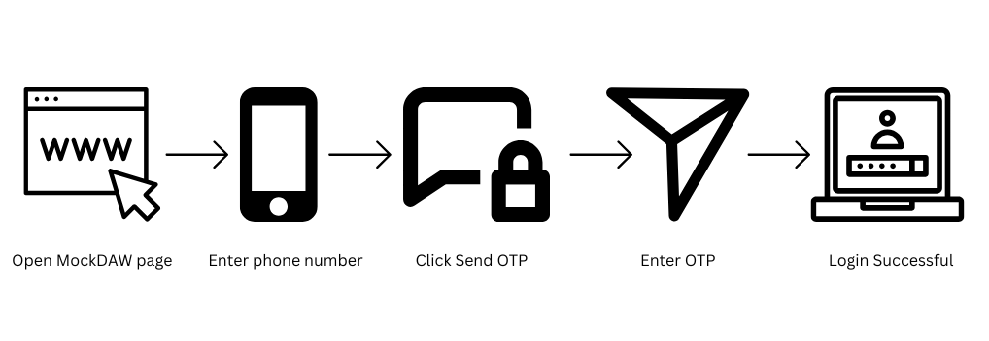

# Unlocking Easy, Secure Logins with WSO2 Identity Server

Ever stared at your login screen, typing your password for the third time, wishing it could be easier? With **WSO2 Identity Server**, you can **log in without ever typing a password**, using **Passwordless SMS OTP Authentication** — just a code sent to your phone!

---

## Why Passwordless Login Matters

Passwords are a pain. People forget them. Hackers steal them. And constantly typing long, complicated passwords is annoying. WSO2 solves this by:

- **Making login easy:** Just enter your phone number and a one-time code.  
- **Keeping you safe:** No passwords to steal, so hackers have less to target.  
- **Saving time:** Faster logins mean happier users.  

Think about it — no more “Forgot Password?” emails. Logging in feels simple and safe.

---

## How Developers Can Try It: MockDAW

For developers building apps, WSO2 offers **MockDAW**. It’s like a **practice playground** for testing SMS logins safely:

- **Test without sending real messages:** Developers can see how login works without bothering real users.  
- **Simulate different scenarios:** Make sure everything works perfectly before going live.  
- **Safe and quick:** OTP codes are temporary and secure within the test environment.  

### **Visual Guide**
Here’s a flowchart showing how MockDAW simulates passwordless SMS login:

*Flowchart showing the MockDAW passwordless login simulation*

It’s perfect for creating **smooth login experiences** for real users.

---

## How This Helps Everyone

Organizations and users both benefit:

- **Users stay happy:** Logging in is quick, easy, and stress-free.  
- **Support teams relax:** Fewer “forgot password” calls.  
- **Apps get used faster:** New users can start immediately.  

In short, WSO2 makes life easier for both people and businesses.

---

## How to Try It

Getting started is simple:

1. **Install WSO2 Identity Server** from [WSO2](https://wso2.com/identity-server/).  
2. **Enable MockDAW** to simulate SMS codes safely.  
3. **Connect your app** to use passwordless login.  
4. **Test it out:** Enter a phone number, receive the code, and log in instantly.  

No real messages, no stress, just smooth testing.

---

## Why You Should Care

Passwordless login isn’t just for tech experts. It’s **for everyone** who wants:

- Simple, fast logins  
- Safer accounts  
- A smooth experience  

WSO2 Identity Server makes it easy, secure, and enjoyable.

---

## Final Thoughts

With **WSO2 Identity Server** and **MockDAW**, logging in becomes:

- **Safe**  
- **Quick**  
- **Effortless**  

No more passwords. No more stress. Just a smooth experience your users will love from the very first login.

*Learn more: [WSO2 Identity Server Documentation](https://is.docs.wso2.com/en/latest/).*
